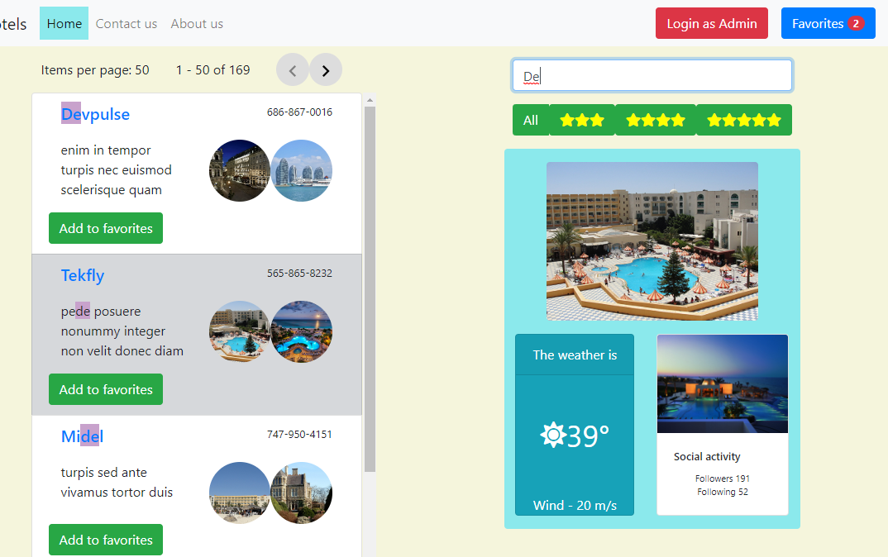

# Hotels
Here is the live demo CLICK TO SEE DEMO
[CLICK TO SEE DEMO](https://vintizer.github.io/ngWeather/hotels "DEMO")

To start project you need clone it and start command  
`npm install`  
and then  
`ng serve -o`  
For starting fake data server in production mode  
`npm run serverProd`  
For starting fake data server in developing mode  
`npm run server`  
Difference between production and developing servers is different port - 3030 and 3000;